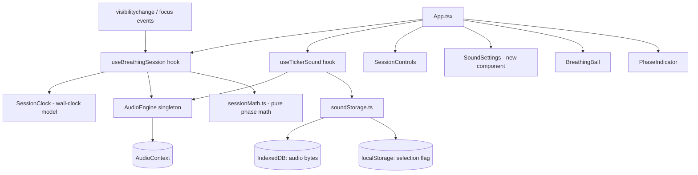
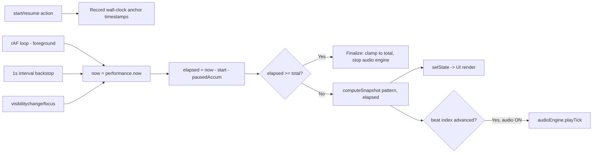
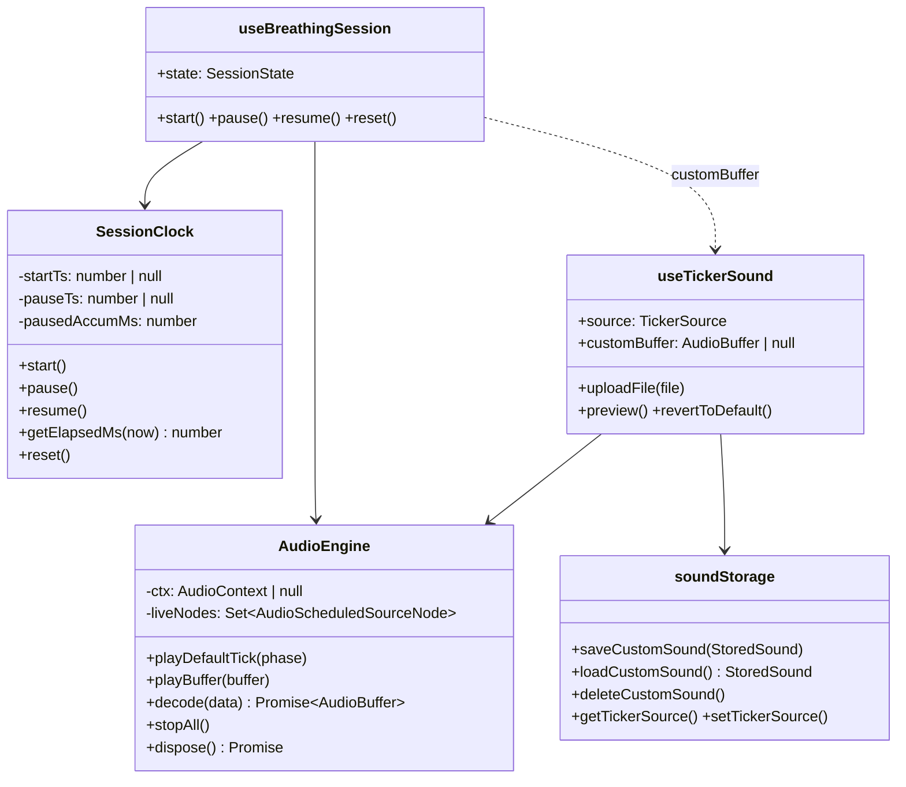
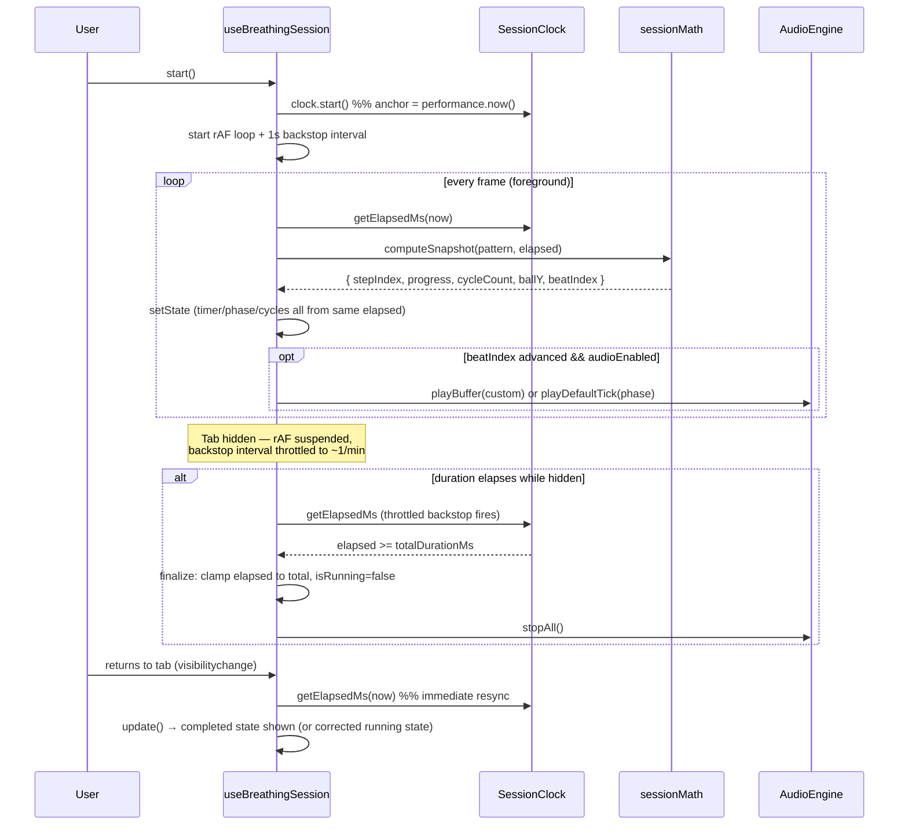
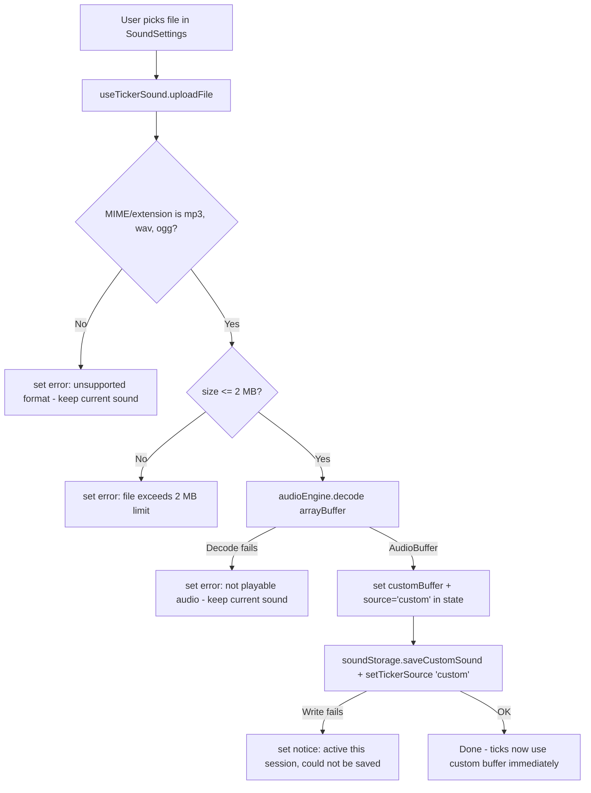
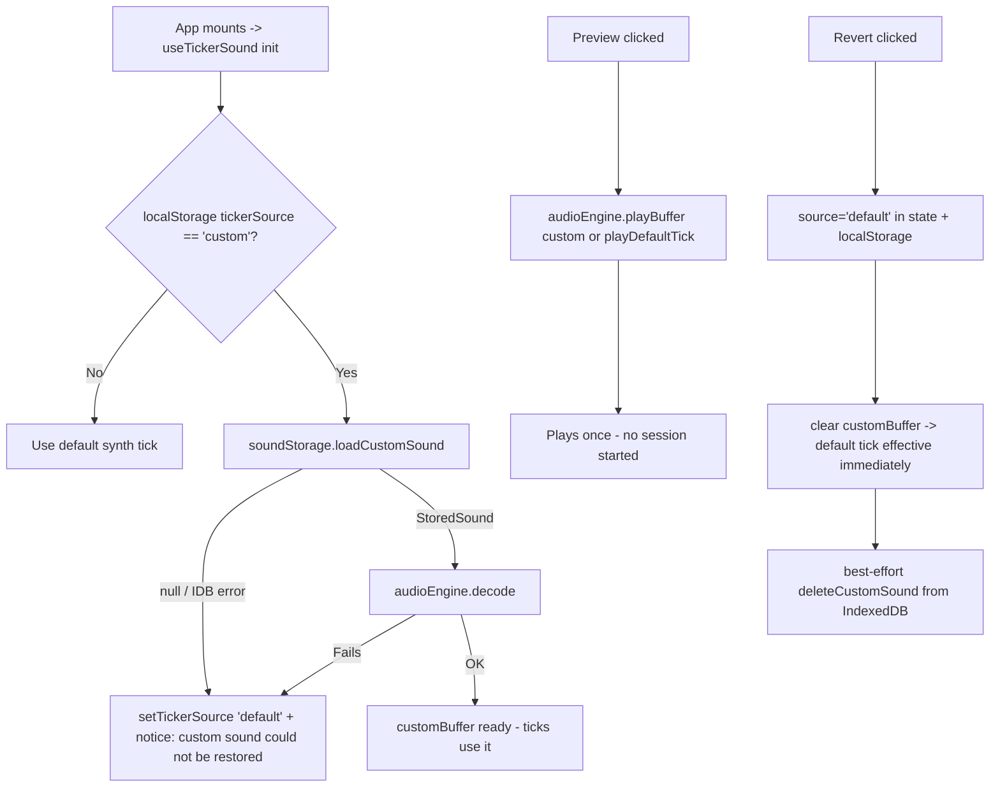
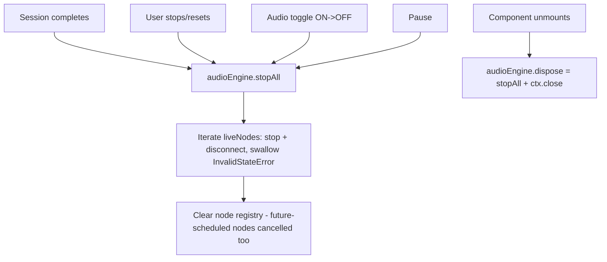

# Design Document

## Overview

This design covers three improvements to the FOCI Breathe session screen:

1. **Wall-clock session timing** — replace the current delta-accumulation timer with a timestamp-anchored model so elapsed time, phase, progress, and cycle count are always derived deterministically from real elapsed time (Requirements 1, 2, 6).
2. **Session audio lifecycle** — centralize all Web Audio usage in a single audio engine that can stop and cancel everything on completion, manual stop, unmount, or toggle-off (Requirement 3).
3. **Custom ticker sound** — upload, validate, preview, persist (IndexedDB + localStorage), and revert a user-provided ticker sound (Requirements 4, 5, 6).

### Current-state analysis (research findings)

- `src/hooks/useBreathingSession.ts` accumulates `delta = now - lastTick` per `requestAnimationFrame` callback into `accRef` and **skips any delta > 200 ms** (line 119). Browsers throttle/suspend rAF in background tabs, so the session clock freezes when the tab is hidden and never catches up. This violates Requirements 1 and 2 and is the primary defect being fixed.
- Phase progression is incremental (`phaseElapsedMs -= stepDuration`, advance one step at a time), so even without the 200 ms guard, a large gap would advance at most one phase per frame.
- The metronome is an independent `setInterval(tick, pattern.defaultBeatMs)` that drifts relative to the session clock, is throttled in background tabs, always plays the *inhale* tick params, and is the only thing stopped at pause/reset. The `AudioContext` is created lazily and **never closed**; tick nodes are short-lived (≤50 ms) but scheduled nodes are not tracked, so nothing can be cancelled.
- Session completion (`acc.elapsedMs >= totalDurationMs`) only fires inside the rAF tick, so a backgrounded tab will not complete the session until focus returns — and on return the frozen accumulator means it completes *late* with wrong elapsed time.
- The app is React 19 + TypeScript + Vite with **no test framework installed** (`package.json` has no test deps) and no storage layer.

### Design goals

- A single **pure function** maps `(pattern, elapsedMs)` → full derived session snapshot, so timer, phase, progress, cycle count, and ball position are always mutually consistent (Req 1.5).
- The clock is **anchored**, not accumulated: `elapsed = now - startTimestamp - pausedAccumulatedMs` (Req 1.1–1.4).
- Rendering cadence (rAF) is decoupled from time correctness; a low-frequency interval backstop plus `visibilitychange`/`focus` listeners guarantee completion and resync even when rAF is suspended (Req 2).
- All audio flows through one engine object with `stopAll()`/`dispose()`; nothing creates audio nodes outside it (Req 3).
- Custom sound storage is local-only (IndexedDB for the audio bytes, localStorage for the selection flag) with graceful degradation when storage fails (Req 4, 5, 6.4, 6.5).

## Architecture

### System Architecture Diagram



### Data Flow Diagram



## Components and Interfaces

### 1. `sessionMath.ts` (new, `src/utils/`)

Pure, side-effect-free derivation of session state from elapsed time. This is the core of the wall-clock model and is unit-testable without React or timers.

- **Responsibilities:** Map `(pattern, elapsedMs)` to step index, phase progress, cycle count, ball Y, and beat index. Handle arbitrary forward jumps (e.g. tab backgrounded for 10 minutes) in O(1) via modular arithmetic over the cycle duration — no per-step iteration of missed time.
- **Interfaces:**

```typescript
interface SessionSnapshot {
  stepIndex: number;
  phaseProgress: number;   // 0..1 within current step
  cycleCount: number;      // completed full cycles
  ballY: number;           // 0..1, eased
  beatIndex: number;       // floor(elapsedMs / pattern.defaultBeatMs) — for metronome
}

function computeSnapshot(pattern: BreathingPattern, elapsedMs: number): SessionSnapshot;
```

- **Algorithm:** `cycleCount = floor(elapsed / cycleDurationMs)`; `inCycleMs = elapsed % cycleDurationMs`; walk the (≤4) steps of one cycle to find the current step and its progress; compute `ballY` with the existing cosine ease between `getStartY(stepIndex)` and `step.targetY`.
- **Dependencies:** `types/breathing.ts` only.

### 2. `SessionClock` (new, `src/utils/sessionClock.ts`)

A small plain class encapsulating the anchored wall-clock model (Req 1.1, 1.2, 1.4).

```typescript
class SessionClock {
  start(): void;                    // records startTs = performance.now(), clears pause state
  pause(): void;                    // records pauseTs
  resume(): void;                   // pausedAccumMs += now - pauseTs
  getElapsedMs(now?: number): number; // now - startTs - pausedAccumMs (0 if not started; frozen at pauseTs while paused)
  reset(): void;
}
```

`performance.now()` is used (monotonic, immune to system clock changes). Paused intervals are excluded by accumulating pause spans, never by mutating the start anchor.

### 3. `AudioEngine` (new, `src/audio/audioEngine.ts`)

Module-level singleton owning the one `AudioContext` and all node lifecycles (Req 3). The existing `playTick` synthesis code moves here unchanged in character.

- **Responsibilities:** create/resume the `AudioContext` on demand (user gesture), play synthesized default ticks and decoded custom-buffer ticks, track every live/scheduled source node, stop and cancel everything on demand, close the context on dispose.
- **Interfaces:**

```typescript
interface AudioEngine {
  playDefaultTick(phase: BreathPhase): void;       // synthesized tick, per-phase pitch/volume (TICK_PARAMS)
  playBuffer(buffer: AudioBuffer): void;            // custom ticker / preview playback
  decode(data: ArrayBuffer): Promise<AudioBuffer>;  // validation + restore decoding
  stopAll(): void;          // stop every tracked source, disconnect, clear registry (Req 3.1, 3.2, 3.4, 3.5)
  dispose(): Promise<void>; // stopAll + close AudioContext (Req 3.3)
}
```

- **Node tracking:** every `AudioBufferSourceNode`/`OscillatorNode` started by the engine is added to an internal `Set` and removed in its `onended` handler. `stopAll()` iterates the set calling `stop()` + `disconnect()` inside try/catch (stopping an already-ended node throws `InvalidStateError`, which is swallowed). Because all scheduling goes through the engine, "cancel scheduled events" (Req 3.4) reduces to stopping tracked nodes whose start time is in the future — `stop()` on a not-yet-started node cancels it.
- **Design decision:** a singleton (not per-hook instance) because the custom-sound preview (sound settings) and the session metronome must share one `AudioContext` — browsers cap the number of contexts, and a shared context lets `stopAll` cover preview audio too.

### 4. `useBreathingSession` (rewritten hook)

Same external API as today (`{ state, start, pause, resume, reset }`) so `App.tsx`, `SessionControls`, `BreathingBall`, and `PhaseIndicator` need only minimal changes.

- **Responsibilities:** own the `SessionClock`, drive UI updates, detect phase-beat boundaries for ticker sounds, detect and finalize completion, resync on visibility/focus.
- **Internal mechanics:**
  - `update(now)` — the single reconciliation function. Computes `elapsed = clock.getElapsedMs(now)`; if `elapsed >= totalDurationMs`, finalizes (below); else derives `SessionSnapshot` via `computeSnapshot` and calls `setState`. Compares the new `beatIndex` against `lastBeatIndexRef`; if it advanced **by exactly 1** and audio is enabled, plays the tick for the phase that just began (custom buffer if active, else default synth). If it advanced by more than 1 (background catch-up), plays at most one tick — no burst of stale ticks on focus return.
  - **Drivers of `update`:** (a) a rAF loop while running and visible — smooth ball animation; (b) a 1-second `setInterval` backstop — browsers throttle but do not fully stop intervals in background tabs (typically ≥1/min), which bounds background completion latency (Req 2.3, 2.4); (c) `visibilitychange` and `focus` listeners that call `update(performance.now())` immediately, guaranteeing instant resync with no user interaction (Req 2.2, 6.2).
  - **Completion finalization (Req 2.3–2.5, 3.1):** when `elapsed >= totalDurationMs`, set state with `elapsedMs` **clamped to `totalDurationMs`**, `cycleCount` derived from the clamped value, `phaseLabel: 'Done'`, `isRunning: false`; cancel rAF, clear the backstop interval, and call `audioEngine.stopAll()`. Finalization is idempotent (guarded by a ref) since rAF, interval, and visibility handlers can race.
  - **`pause`** — `clock.pause()`, cancel rAF + interval, `audioEngine.stopAll()`. **`resume`** — `clock.resume()`, restart drivers. **`reset`** — clock reset + `stopAll`. **Unmount effect** — cancel drivers, `audioEngine.dispose()` (Req 3.3).
  - **Audio toggle OFF mid-session (Req 3.5):** an effect watches `audioEnabled`; on `true → false` it calls `audioEngine.stopAll()`; the beat handler independently checks `audioEnabledRef.current` before starting new ticks.
- **Dependencies:** `SessionClock`, `sessionMath`, `AudioEngine`, and the active ticker buffer (passed in from `useTickerSound` via a parameter or ref).

### 5. `soundStorage.ts` (new, `src/audio/soundStorage.ts`)

Thin promise-based persistence layer. No external dependency; raw IndexedDB is wrapped in ~60 lines.

```typescript
const DB_NAME = 'foci-breathe';
const STORE = 'sounds';            // single record key: 'customTicker'
const SELECTION_KEY = 'foci-breathe:tickerSource'; // localStorage: 'default' | 'custom'

interface StoredSound { data: ArrayBuffer; mimeType: string; name: string; savedAt: number; }

saveCustomSound(sound: StoredSound): Promise<void>;   // put (replaces previous — Req 5.8)
loadCustomSound(): Promise<StoredSound | null>;
deleteCustomSound(): Promise<void>;
getTickerSource(): 'default' | 'custom';              // localStorage read, defaults to 'default'
setTickerSource(source: 'default' | 'custom'): void;
```

- **Design decision:** audio bytes go to IndexedDB (localStorage's ~5 MB string quota and base64 inflation make it unsuitable); the small selection flag goes to localStorage for synchronous read at startup (Req 5.3). Every function rejects/no-ops gracefully when IndexedDB is unavailable so callers can degrade per Req 6.5.

### 6. `useTickerSound` (new hook, `src/hooks/useTickerSound.ts`)

App-level hook owning the custom-ticker feature state and orchestration.

```typescript
interface TickerSoundApi {
  source: 'default' | 'custom';
  customSoundName: string | null;
  customBuffer: AudioBuffer | null;   // consumed by useBreathingSession for ticks
  error: string | null;               // validation/decode errors (Req 4.2–4.4)
  notice: string | null;              // non-blocking notices (Req 5.5, 6.5)
  uploadFile(file: File): Promise<void>;
  preview(): void;                    // plays active sound once via audioEngine (Req 5.1, 5.2)
  revertToDefault(): Promise<void>;   // Req 5.6, 5.7
  dismissMessage(): void;
}
```

- **Validation pipeline in `uploadFile`** (Req 4.2–4.4): type check (`file.type` in `audio/mpeg`, `audio/mp3`, `audio/wav`, `audio/x-wav`, `audio/ogg`; fallback to extension `.mp3/.wav/.ogg` when MIME is empty) → size check (**2 MB limit**, message states the limit) → `audioEngine.decode(arrayBuffer)` as the decodability gate. Any failure sets `error` and leaves the active sound untouched. Only after successful decode: set `customBuffer` (in-memory, immediately usable — Req 4.5, 6.5), then persist via `saveCustomSound` + `setTickerSource('custom')`; persistence failure sets `notice` ("sound active for this session but couldn't be saved") without rolling back the in-memory buffer.
- **Restore on mount** (Req 5.4, 5.5): if `getTickerSource() === 'custom'`, load + decode asynchronously; on any failure call `setTickerSource('default')`, `deleteCustomSound()` (best-effort), and set `notice` about the fallback. Restore never blocks first render.
- **`revertToDefault`:** set source `'default'` in state and localStorage synchronously (immediate effect — Req 5.7), clear `customBuffer`, then best-effort `deleteCustomSound()`.

### 7. `SoundSettings.tsx` (new component, `src/components/`)

Rendered in the sidebar beneath the existing audio toggle in `SessionControls` area.

- **Responsibilities:** file input (`accept="audio/mpeg,audio/wav,audio/ogg,.mp3,.wav,.ogg"`), current-sound label ("Default tick" / custom file name), Preview button, "Use default" revert button (visible only when custom is active — Req 5.6), inline error (red) and notice (amber, dismissible) messages.
- **Dependencies:** receives the `TickerSoundApi` object as props from `App`. Purely presentational; all logic lives in `useTickerSound`.

### 8. `App.tsx` (modified)

Wires `useTickerSound` and passes `customBuffer` (and `source`) into `useBreathingSession`; renders `SoundSettings`. Upload/preview/revert run entirely outside the session update loop, so they cannot disturb timing (Req 6.3 — the only shared resource is the AudioContext, which is non-blocking).

## Data Models

### Core Data Structure Definitions

```typescript
// ── Timing (new) ──────────────────────────────────────────────
interface ClockState {
  startTs: number | null;     // performance.now() at start
  pauseTs: number | null;     // set while paused
  pausedAccumMs: number;      // total excluded paused time
}

interface SessionSnapshot {              // pure derivation output
  stepIndex: number;
  phaseProgress: number;                 // 0..1
  cycleCount: number;
  ballY: number;                         // 0..1, eased
  beatIndex: number;                     // metronome boundary detection
}

// SessionState (types/breathing.ts) is unchanged — derived values now
// come from computeSnapshot instead of incremental accumulation.

// ── Custom ticker sound (new) ─────────────────────────────────
type TickerSource = 'default' | 'custom';

interface StoredSound {
  data: ArrayBuffer;          // raw file bytes (re-decoded on restore)
  mimeType: string;
  name: string;               // original filename, for UI display
  savedAt: number;            // Date.now()
}

const MAX_SOUND_BYTES = 2 * 1024 * 1024;  // 2 MB (Req 4.3)
const ACCEPTED_TYPES = ['audio/mpeg', 'audio/mp3', 'audio/wav', 'audio/x-wav', 'audio/ogg'];
```

**Decision — store raw bytes, not decoded PCM:** `AudioBuffer` cannot be structured-cloned into IndexedDB; the original `ArrayBuffer` is small (≤2 MB), survives serialization, and decoding on restore doubles as integrity validation (Req 5.5).

### Data Model Diagrams



## Business Process

### Process 1: Running session under backgrounding (Req 1, 2)



### Process 2: Custom sound upload and validation (Req 4)



### Process 3: Restore on reload, preview, and revert (Req 5)



### Process 4: Audio lifecycle stop paths (Req 3)



## Error Handling

| Scenario | Handling | Req |
|---|---|---|
| Unsupported file type | Reject before reading bytes; inline error names accepted formats; active sound unchanged | 4.2 |
| File over 2 MB | Reject; error message states the 2 MB limit | 4.3 |
| `decodeAudioData` failure | Reject; error "not playable audio"; active sound and persisted state unchanged | 4.4 |
| IndexedDB write fails / quota exceeded / IDB unavailable | Keep in-memory `customBuffer` active for the current session; amber notice "couldn't be saved for next time" | 6.5 |
| Persisted sound missing/corrupt on restore | Fall back to default tick, reset selection flag to `'default'`, best-effort delete, non-blocking notice | 5.5 |
| `AudioContext` suspended (autoplay policy) | Engine calls `ctx.resume()` inside `playTick`/`playBuffer`; all entry points (Start, Preview, toggle) are user gestures, so resume succeeds | 3 |
| `stop()` on ended/unstarted node | try/catch per node in `stopAll()`; `InvalidStateError` swallowed | 3.4 |
| Completion race (rAF vs interval vs visibility handler) | Idempotent finalization guard (ref flag); first caller wins, others no-op | 2.4 |
| System clock changes | `performance.now()` is monotonic — immune by construction | 1.1 |
| Errors inside the rAF/interval update | `computeSnapshot` is pure and total (clamps inputs); no throw paths in the hot loop | 6.1 |

All user-facing messages render inline in `SoundSettings` (no blocking dialogs); `error` and `notice` are separate channels so a validation error never hides a persistence notice.

## Testing Strategy

The project has no test infrastructure; add **Vitest + @testing-library/react + jsdom + fake-indexeddb** as dev dependencies (Vitest is the natural fit for a Vite project).

### Unit tests (highest value, no DOM needed)

- **`sessionMath.computeSnapshot`** — table-driven tests per pattern: elapsed 0, mid-phase, exact phase boundary, exact cycle boundary, large jump (e.g. 10 min into a session — verifies O(1) catch-up and correct cycleCount/stepIndex), elapsed beyond total. Asserts timer/phase/cycle consistency from a single elapsed value (Req 1.3, 1.5, 2.2).
- **`SessionClock`** — mock `performance.now`: start→elapsed grows; pause freezes elapsed; resume excludes paused span; multiple pause/resume cycles accumulate correctly (Req 1.1, 1.2, 1.4).
- **`soundStorage`** — against `fake-indexeddb`: save/load round-trip preserves bytes and metadata; save replaces existing record (Req 5.8); delete; load when empty returns null; simulated IDB failure rejects cleanly.
- **`AudioEngine`** — with a mocked `AudioContext` (stub nodes recording `start`/`stop`/`disconnect` calls): every started node is tracked; `stopAll` stops all live and future-scheduled nodes and clears the registry; `dispose` closes the context; `stop` on an ended node doesn't throw out of `stopAll` (Req 3.1–3.4).

### Hook tests (`renderHook` + fake timers + mocked `performance.now`)

- **`useBreathingSession`:** elapsed derives from mocked wall clock, not tick count (advance `performance.now` by 90s while firing only one timer callback → state shows 90s); completion clamps `elapsedMs` to `totalDurationMs` when the clock jumps far past the end (Req 2.4); a dispatched `visibilitychange` event triggers immediate resync (Req 2.2); completion/stop/unmount/toggle-off each call `audioEngine.stopAll` (spied) (Req 3.1–3.3, 3.5); at most one tick plays after a multi-beat jump.
- **`useTickerSound`:** upload happy path sets buffer + persists; each validation failure (type, size, decode) sets `error` and leaves prior state intact (Req 4.2–4.4); restore-on-mount happy path and corrupted-data fallback with notice (Req 5.4, 5.5); revert updates state + localStorage and deletes the IDB record (Req 5.7); persistence failure keeps the sound usable and sets `notice` (Req 6.5).

### Component tests

- **`SoundSettings`:** error and notice rendering, revert button visibility only when custom is active, preview button invokes the API, file input has the correct `accept` attribute.

### Manual verification checklist

- Start a 1-minute session, background the tab for the full duration, return: session shows completed at 1:00, no audio playing (Req 2.3, 2.5, 3.6).
- Background mid-session for ~30s, return: timer/phase/cycles jump forward correctly with no backward jump or freeze (Req 2.2).
- 20-minute foreground session: displayed timer matches a stopwatch within ~1s (Req 6.1).
- Upload mp3/wav/ogg, preview, reload page → custom sound restored; revert → default immediately (Req 4, 5).
- DevTools → Application → delete the IndexedDB record, reload → fallback notice, default sound (Req 5.5).
