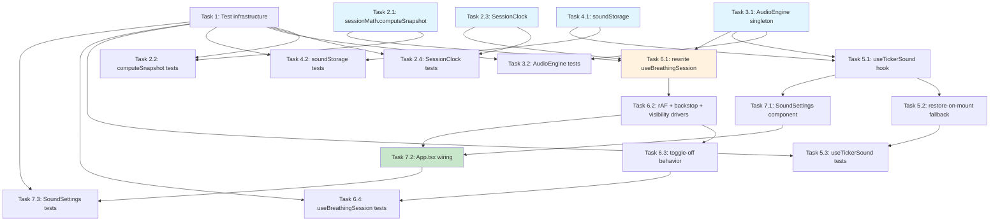

# Implementation Plan

- [x] 1. Set up test infrastructure
  - Add `vitest`, `@testing-library/react`, `@testing-library/jest-dom`, `jsdom`, and `fake-indexeddb` as dev dependencies
  - Configure Vitest in `vite.config.ts` (or `vitest.config.ts`) with the `jsdom` environment and a test setup file registering jest-dom matchers
  - Add a `test` script to `package.json` and verify the runner executes with a trivial smoke test
  - _Requirements: (enables test-driven tasks below)_

- [x] 2. Implement pure wall-clock derivation utilities
- [x] 2.1 Create `sessionMath.ts` with `computeSnapshot`
  - Create `src/utils/sessionMath.ts` exporting the `SessionSnapshot` interface and `computeSnapshot(pattern, elapsedMs)`
  - Derive `cycleCount` and in-cycle position via modular arithmetic over the cycle duration (O(1) for arbitrary forward jumps), walk the steps of one cycle for `stepIndex` and `phaseProgress`, compute `ballY` with the existing cosine ease, and compute `beatIndex = floor(elapsedMs / pattern.defaultBeatMs)`
  - Clamp/guard inputs so the function is total (no throw paths; handles elapsed ≤ 0 and elapsed beyond total)
  - _Requirements: 1.2, 1.3, 1.5, 6.1_

- [x] 2.2 Write unit tests for `computeSnapshot`
  - Table-driven tests per breathing pattern: elapsed 0, mid-phase, exact phase boundary, exact cycle boundary, large jump (e.g. 10 minutes — verifies O(1) catch-up and correct `cycleCount`/`stepIndex`), and elapsed beyond total
  - Assert step index, phase progress, cycle count, ball Y, and beat index are mutually consistent from a single elapsed value
  - _Requirements: 1.3, 1.5, 2.2_

- [x] 2.3 Create `SessionClock` class
  - Create `src/utils/sessionClock.ts` with `start()`, `pause()`, `resume()`, `getElapsedMs(now?)`, and `reset()` per the design
  - Anchor on `performance.now()` at start; exclude paused intervals by accumulating pause spans (`pausedAccumMs`), never by mutating the start anchor; return 0 when not started and a frozen value while paused
  - _Requirements: 1.1, 1.2, 1.4_

- [x] 2.4 Write unit tests for `SessionClock`
  - Mock `performance.now`: elapsed grows after start; pause freezes elapsed; resume excludes the paused span; multiple pause/resume cycles accumulate correctly; reset clears all state
  - _Requirements: 1.1, 1.2, 1.4_

- [x] 3. Implement the audio engine
- [x] 3.1 Create `AudioEngine` singleton
  - Create `src/audio/audioEngine.ts` as a module-level singleton exposing `playDefaultTick(phase)`, `playBuffer(buffer)`, `decode(data)`, `stopAll()`, and `dispose()`
  - Move the existing tick-synthesis code (per-phase `TICK_PARAMS`) from `useBreathingSession` into `playDefaultTick`; create/resume the `AudioContext` lazily inside `playDefaultTick`/`playBuffer`
  - Track every started `AudioBufferSourceNode`/`OscillatorNode` in an internal `Set`, removing each in its `onended` handler; `stopAll()` iterates the set calling `stop()` + `disconnect()` in per-node try/catch (swallowing `InvalidStateError`) and clears the registry, which also cancels future-scheduled nodes; `dispose()` runs `stopAll()` then closes the context
  - _Requirements: 3.1, 3.2, 3.3, 3.4, 3.5_

- [x] 3.2 Write unit tests for `AudioEngine`
  - Use a mocked `AudioContext` with stub nodes recording `start`/`stop`/`disconnect` calls
  - Assert every started node is tracked; `stopAll` stops all live and future-scheduled nodes and clears the registry; `dispose` closes the context; a node throwing on `stop()` (already-ended) does not propagate out of `stopAll`
  - _Requirements: 3.1, 3.2, 3.3, 3.4_

- [x] 4. Implement sound persistence
- [x] 4.1 Create `soundStorage.ts`
  - Create `src/audio/soundStorage.ts` wrapping raw IndexedDB (`foci-breathe` DB, `sounds` store, single `customTicker` record) with `saveCustomSound`, `loadCustomSound`, and `deleteCustomSound`, plus synchronous localStorage helpers `getTickerSource`/`setTickerSource` (key `foci-breathe:tickerSource`, default `'default'`)
  - Define the `StoredSound` interface (`data: ArrayBuffer`, `mimeType`, `name`, `savedAt`); `saveCustomSound` uses `put` so a new upload replaces the previous record
  - Make every function reject or no-op gracefully when IndexedDB/localStorage is unavailable so callers can degrade
  - _Requirements: 5.3, 5.7, 5.8, 6.4, 6.5_

- [x] 4.2 Write unit tests for `soundStorage`
  - Against `fake-indexeddb`: save/load round-trip preserves bytes and metadata; saving twice replaces the existing record; delete removes the record; load when empty returns null; a simulated IndexedDB failure rejects cleanly without throwing synchronously
  - Test `getTickerSource`/`setTickerSource` round-trip and the `'default'` fallback when localStorage is empty
  - _Requirements: 5.3, 5.8, 6.5_

- [x] 5. Implement the custom ticker sound hook
- [x] 5.1 Create `useTickerSound` hook
  - Create `src/hooks/useTickerSound.ts` returning the `TickerSoundApi` shape from the design (`source`, `customSoundName`, `customBuffer`, `error`, `notice`, `uploadFile`, `preview`, `revertToDefault`, `dismissMessage`)
  - Implement the `uploadFile` validation pipeline: MIME/extension check against MP3/WAV/OGG (extension fallback when `file.type` is empty) → 2 MB size check with the limit stated in the error message → `audioEngine.decode` as the decodability gate; any failure sets `error` and leaves the active sound and persisted state untouched
  - On successful decode, set `customBuffer` and `source: 'custom'` in state first (immediately usable), then persist via `saveCustomSound` + `setTickerSource('custom')`; a persistence failure sets `notice` ("active for this session but couldn't be saved") without rolling back the in-memory buffer
  - Implement `preview()` playing the active sound once via `audioEngine.playBuffer`/`playDefaultTick` without touching session state, and `revertToDefault()` setting `'default'` in state and localStorage synchronously, clearing `customBuffer`, then best-effort `deleteCustomSound()`
  - _Requirements: 4.2, 4.3, 4.4, 4.5, 5.1, 5.2, 5.6, 5.7, 5.8, 6.3, 6.5_

- [x] 5.2 Implement restore-on-mount with fallback in `useTickerSound`
  - On mount, if `getTickerSource() === 'custom'`, asynchronously `loadCustomSound()` + `audioEngine.decode`; on success set `customBuffer` and `customSoundName`
  - On any restore failure (missing record, IDB error, decode failure): call `setTickerSource('default')`, best-effort `deleteCustomSound()`, and set a non-blocking `notice` about falling back to the default sound; restore must never block first render
  - _Requirements: 5.4, 5.5_

- [x] 5.3 Write hook tests for `useTickerSound`
  - With `renderHook`, mocked `audioEngine`, and `fake-indexeddb`: upload happy path sets buffer and persists; each validation failure (type, size, decode) sets `error` and leaves prior state intact; restore-on-mount happy path; corrupted-data restore falls back with notice and resets the selection flag; revert updates state + localStorage and deletes the IDB record; persistence failure keeps the sound usable and sets `notice`
  - _Requirements: 4.2, 4.3, 4.4, 5.4, 5.5, 5.7, 6.5_

- [x] 6. Rewrite the session hook on the wall-clock model
- [x] 6.1 Rewrite `useBreathingSession` with reconciliation loop and completion finalization
  - Rewrite `src/hooks/useBreathingSession.ts` keeping the external API (`{ state, start, pause, resume, reset }`); own a `SessionClock` instance and accept the active custom ticker buffer as a parameter
  - Implement a single `update(now)` reconciliation function: compute `elapsed = clock.getElapsedMs(now)`; if `elapsed >= totalDurationMs` finalize, else derive state via `computeSnapshot` and `setState` (timer, phase, progress, cycle count all from the same elapsed value)
  - Implement beat-boundary tick playback: compare new `beatIndex` to `lastBeatIndexRef`; if advanced and audio enabled, play the tick for the phase that just began (custom buffer if active, else default synth); after a multi-beat jump play at most one tick
  - Implement idempotent finalization (ref guard): clamp `elapsedMs` to `totalDurationMs`, derive final cycle count from the clamped value, set done/not-running state, cancel rAF and the backstop interval, and call `audioEngine.stopAll()`
  - Wire `pause` (clock.pause + cancel drivers + `stopAll`), `resume` (clock.resume + restart drivers), `reset` (clock.reset + `stopAll`), and an unmount effect (cancel drivers + `audioEngine.dispose()`); remove the old delta-accumulation loop, the 200 ms skip guard, and the independent metronome interval
  - _Requirements: 1.1, 1.2, 1.3, 1.5, 2.4, 3.1, 3.2, 3.3, 4.5_

- [x] 6.2 Add update drivers: rAF loop, 1-second backstop interval, and visibility/focus listeners
  - While running, drive `update` from (a) a `requestAnimationFrame` loop for smooth foreground animation, (b) a 1-second `setInterval` backstop that bounds background completion latency under throttling, and (c) `visibilitychange` and `focus` listeners calling `update(performance.now())` immediately for instant resync without user interaction
  - Ensure all drivers are registered on start/resume and torn down on pause, completion, reset, and unmount
  - _Requirements: 2.1, 2.2, 2.3, 2.4, 2.5, 3.6, 6.1, 6.2_

- [x] 6.3 Implement audio-toggle-off behavior mid-session
  - Add an effect watching `audioEnabled`: on `true → false` call `audioEngine.stopAll()`; have the beat handler check `audioEnabledRef.current` before starting any new tick
  - _Requirements: 3.5_

- [x] 6.4 Write hook tests for `useBreathingSession`
  - With `renderHook`, fake timers, and mocked `performance.now`: elapsed derives from the wall clock, not tick count (advance `performance.now` by 90 s while firing a single timer callback → state shows 90 s); completion clamps `elapsedMs` to `totalDurationMs` when the clock jumps far past the end; a dispatched `visibilitychange` event triggers immediate resync; completion, manual stop, unmount, and toggle-off each call a spied `audioEngine.stopAll` (unmount also calls `dispose`); at most one tick plays after a multi-beat jump
  - _Requirements: 1.2, 2.2, 2.4, 2.5, 3.1, 3.2, 3.3, 3.5_

- [x] 7. Build the sound settings UI and wire everything together
- [x] 7.1 Create `SoundSettings` component
  - Create `src/components/SoundSettings.tsx` receiving the `TickerSoundApi` as props (purely presentational)
  - Render a file input with `accept="audio/mpeg,audio/wav,audio/ogg,.mp3,.wav,.ogg"`, the current-sound label ("Default tick" or the custom file name), a Preview button, a "Use default" revert button visible only when a custom sound is active, and inline error (red) / dismissible notice (amber) messages
  - Add styles in `src/App.css` consistent with the existing sidebar controls
  - _Requirements: 4.1, 4.2, 5.1, 5.6_

- [x] 7.2 Wire `useTickerSound` and `SoundSettings` into `App.tsx`
  - Call `useTickerSound` in `App.tsx`, pass `customBuffer` (and `source`) into `useBreathingSession`, and render `SoundSettings` beneath the existing audio toggle in the sidebar
  - Confirm upload/preview/revert run outside the session update loop so a running session's timing is unaffected
  - _Requirements: 4.1, 4.5, 6.3_

- [x] 7.3 Write component tests for `SoundSettings`
  - With Testing Library: error and notice messages render from props; the revert button appears only when a custom sound is active; the Preview button invokes the API callback; the file input carries the correct `accept` attribute; selecting a file calls `uploadFile`
  - _Requirements: 4.1, 4.2, 5.1, 5.6_

## Tasks Dependency Diagram

