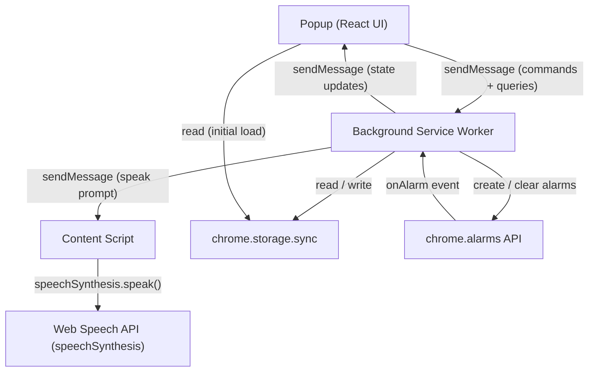
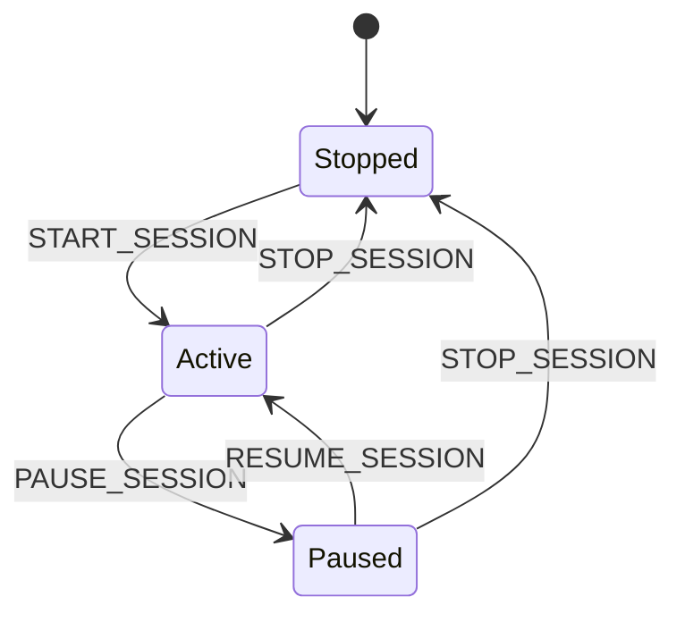

# Design Document: Mindfulness Reminders

## Overview

The Mindfulness Reminders feature is delivered as a standalone Manifest V3 Chrome extension. It runs independently of any FOCI Breathe tab, scheduling periodic audio prompts that nudge the user toward present-moment awareness throughout their day.

The extension has three collaborating runtime contexts:

1. **Background Service Worker** — owns the scheduler, state machine, and settings store. Persists across all tabs and survives popup close. Uses the Chrome `alarms` API for reliable interval firing and `chrome.storage.sync` for settings persistence.
2. **Popup** — the browser-action UI (React + TypeScript, built by Vite). Lets the user configure the session and manage the prompt library. Communicates with the background service worker via `chrome.runtime.sendMessage`.
3. **Content Script (minimal)** — injects into pages only to invoke the Web Speech API, which requires a page context; the service worker itself cannot call `speechSynthesis` directly in MV3.

The overall architecture deliberately keeps business logic in the background service worker so that closing the popup never interrupts an active session.



---

## Architecture

### Chrome Extension Structure

```
extension/
├── manifest.json           # MV3 manifest
├── background.ts           # Service worker entry point
├── content.ts              # Minimal content script for TTS
├── popup/
│   ├── index.html
│   ├── main.tsx            # React entry
│   ├── App.tsx
│   └── components/
│       ├── SessionPanel.tsx
│       ├── IntervalPicker.tsx
│       ├── PromptLibrary.tsx
│       └── VolumeSlider.tsx
└── src/
    ├── types/
    │   └── reminders.ts    # Shared types (messages, settings, state)
    ├── scheduler.ts        # Scheduler logic (pure, testable)
    ├── promptSelector.ts   # Prompt selection / shuffle logic
    ├── settingsStore.ts    # chrome.storage.sync wrapper
    └── voiceEngine.ts      # TTS wrapper (content-script side)
```

### Communication Protocol

All cross-context communication uses typed messages over `chrome.runtime.sendMessage` / `chrome.runtime.onMessage`. The message protocol is defined by a discriminated union in `reminders.ts`.

**Popup → Background commands:**
- `START_SESSION`
- `PAUSE_SESSION`
- `RESUME_SESSION`
- `STOP_SESSION`
- `GET_STATE` (request current state snapshot)
- `UPDATE_INTERVAL` `{ intervalMs: number }`
- `UPDATE_VOLUME` `{ volume: number }` (0–1)
- `ADD_PROMPT` `{ text: string }`
- `DELETE_PROMPT` `{ id: string }`
- `EDIT_PROMPT` `{ id: string; text: string }`

**Background → Popup responses / push updates:**
- `STATE_UPDATE` `{ session: SessionState; settings: ReminderSettings }`
- `ERROR` `{ code: ErrorCode; message: string }`

**Background → Content Script:**
- `SPEAK` `{ text: string; volume: number }`

### Session State Machine



The scheduler stores the wall-clock timestamp of when the current countdown began and the remaining milliseconds at pause time so that the countdown can be resumed accurately.

---

## Components and Interfaces

### Background Service Worker (`background.ts`)

Entry point that wires together the scheduler, settings store, and message handlers. Responsibilities:
- Listen for `chrome.alarms.onAlarm` and delegate to the scheduler
- Listen for `chrome.runtime.onMessage` and route commands
- On install / update: initialize settings store and restore any active session

### Scheduler (`scheduler.ts`)

Pure logic module — no direct Chrome API calls. Accepts an `AlarmAdapter` interface so it is fully testable without the Chrome environment.

```typescript
interface AlarmAdapter {
  create(name: string, delayMs: number): void;
  clear(name: string): void;
}

interface SchedulerState {
  status: 'stopped' | 'active' | 'paused';
  intervalMs: number;
  /** Epoch ms when countdown started (active) or undefined */
  countdownStartedAt: number | undefined;
  /** Remaining ms saved at pause time */
  remainingMs: number | undefined;
}

interface Scheduler {
  start(intervalMs: number): void;
  pause(): void;
  resume(): void;
  stop(): void;
  /** Returns remaining ms for UI display; undefined when not active */
  getRemainingMs(now: number): number | undefined;
  getStatus(): 'stopped' | 'active' | 'paused';
}
```

### Prompt Selector (`promptSelector.ts`)

Manages the shuffle cycle to prevent repetition. Maintains a deck (shuffled copy of the library). When the deck is exhausted it is reshuffled.

```typescript
interface PromptSelector {
  /** Returns the next prompt to play; never returns the same prompt twice in a row (if library > 1) */
  next(library: Prompt[]): Prompt;
  /** Reset internal state (e.g., when library changes significantly) */
  reset(): void;
}
```

### Settings Store (`settingsStore.ts`)

Wraps `chrome.storage.sync` with typed helpers. Falls back to defaults on read errors.

```typescript
interface SettingsStore {
  load(): Promise<ReminderSettings>;
  save(settings: Partial<ReminderSettings>): Promise<void>;
}
```

### Voice Engine (`voiceEngine.ts`) — content script

Thin wrapper around `window.speechSynthesis`. Listens for `SPEAK` messages from the background service worker.

```typescript
interface VoiceEngine {
  speak(text: string, volume: number): Promise<void>;
  isAvailable(): boolean;
}
```

### Popup Components

| Component | Responsibility |
|---|---|
| `SessionPanel` | Displays session status, countdown timer, start/pause/resume/stop buttons |
| `IntervalPicker` | Preset buttons + optional custom number input with validation |
| `PromptLibrary` | List of prompts with add / edit / delete controls and validation |
| `VolumeSlider` | 0–100% volume input, debounced save |

---

## Data Models

### `Prompt`

```typescript
interface Prompt {
  readonly id: string;        // UUID v4
  readonly text: string;      // Mindfulness question, non-empty, non-whitespace
}
```

### `ReminderSettings`

```typescript
interface ReminderSettings {
  readonly intervalMs: number;        // 1–480 minutes in ms; default 30 * 60_000
  readonly volume: number;            // 0.0–1.0; default 0.8
  readonly prompts: readonly Prompt[];
}
```

Default prompts (Requirement 3.6):

```typescript
const DEFAULT_PROMPTS: Prompt[] = [
  { id: '...', text: 'What do you see?' },
  { id: '...', text: 'What do you hear?' },
  { id: '...', text: 'What do you feel?' },
  { id: '...', text: 'What do you smell?' },
  { id: '...', text: 'What do you notice in your body right now?' },
];
```

### `SessionState`

```typescript
interface SessionState {
  readonly status: 'stopped' | 'active' | 'paused';
  readonly remainingMs: number | undefined;   // undefined when stopped
}
```

### Message Types

```typescript
type PopupToBackground =
  | { type: 'START_SESSION' }
  | { type: 'PAUSE_SESSION' }
  | { type: 'RESUME_SESSION' }
  | { type: 'STOP_SESSION' }
  | { type: 'GET_STATE' }
  | { type: 'UPDATE_INTERVAL'; intervalMs: number }
  | { type: 'UPDATE_VOLUME'; volume: number }
  | { type: 'ADD_PROMPT'; text: string }
  | { type: 'DELETE_PROMPT'; id: string }
  | { type: 'EDIT_PROMPT'; id: string; text: string };

type BackgroundToPopup =
  | { type: 'STATE_UPDATE'; session: SessionState; settings: ReminderSettings }
  | { type: 'ERROR'; code: ErrorCode; message: string };

type BackgroundToContent =
  | { type: 'SPEAK'; text: string; volume: number };
```

### `ErrorCode`

```typescript
type ErrorCode =
  | 'TTS_UNAVAILABLE'
  | 'STORAGE_READ_ERROR'
  | 'STORAGE_WRITE_ERROR'
  | 'EMPTY_LIBRARY';
```

---

## Correctness Properties

*A property is a characteristic or behavior that should hold true across all valid executions of a system — essentially, a formal statement about what the system should do. Properties serve as the bridge between human-readable specifications and machine-verifiable correctness guarantees.*

### Property 1: Scheduler initial countdown accuracy

*For any* valid interval value (1–480 minutes in milliseconds), immediately after `scheduler.start(intervalMs)`, `getRemainingMs(now)` SHALL equal `intervalMs` within a small epsilon (≤10 ms for clock resolution).

**Validates: Requirements 1.1**

### Property 2: Pause / resume countdown round-trip

*For any* active scheduler started with any valid `intervalMs`, pausing at any elapsed time `t` and then immediately resuming SHALL result in `getRemainingMs(now)` being equal to the value of `getRemainingMs(now)` at the moment of pause (within ≤10 ms epsilon).

**Validates: Requirements 5.3, 5.4**

### Property 3: Prompt non-repetition invariant

*For any* prompt library with more than one prompt, for any number of successive calls to `promptSelector.next()`, no two consecutive calls SHALL return the same prompt ID.

**Validates: Requirements 4.2**

### Property 4: Prompt cycle completeness

*For any* prompt library of size `n ≥ 1`, every consecutive window of `n` calls to `promptSelector.next()` SHALL yield each prompt exactly once (i.e., all `n` distinct IDs appear before any repeats).

**Validates: Requirements 4.1, 4.3**

### Property 5: Prompt validation rejects whitespace-only text

*For any* string composed entirely of whitespace characters (including the empty string), `validatePromptText()` SHALL return `false` and any mutation operation (add or edit) using that text SHALL leave the prompt library unchanged.

**Validates: Requirements 3.5**

### Property 6: Interval validation partitions the integer domain

*For any* integer `n` in [1, 480] (minutes), `validateIntervalMinutes(n)` SHALL return `true`; *for any* integer `n` outside [1, 480], `validateIntervalMinutes(n)` SHALL return `false`.

**Validates: Requirements 2.4, 2.5**

### Property 7: Settings persistence round-trip

*For any* `ReminderSettings` object (with a valid interval, volume in [0,1], and prompt array), calling `settingsStore.save(settings)` followed by `settingsStore.load()` SHALL return a structurally equivalent object (same interval, volume, and prompts array).

**Validates: Requirements 7.1, 2.1, 3.1**

### Property 8: Prompt library capacity enforcement

*For any* prompt library already containing exactly 100 prompts, attempting to add another prompt SHALL be rejected, and the library size SHALL remain 100.

**Validates: Requirements 3.7**

### Property 9: Prompt CRUD mutations are reflected in the library

*For any* existing prompt library and any valid mutation (add a non-whitespace prompt, delete a prompt by ID, or edit a prompt's text to a non-whitespace string), the resulting library SHALL respectively: contain a prompt with the added text, not contain the deleted ID, and contain the edited ID with the new text.

**Validates: Requirements 3.2, 3.3, 3.4**

### Property 10: Voice engine applies configured volume

*For any* volume value `v` in [0.0, 1.0] and any non-empty prompt text, when `voiceEngine.speak(text, v)` is called, the `SpeechSynthesisUtterance` created SHALL have its `volume` property set to `v`.

**Validates: Requirements 6.3**

---

## Error Handling

| Scenario | Behavior |
|---|---|
| Web Speech API unavailable | Content script reports `TTS_UNAVAILABLE`; background forwards error to popup as `ERROR` message; popup displays a clear non-dismissible banner |
| `chrome.storage.sync` read failure | `settingsStore.load()` catches the error, returns default config, and emits `STORAGE_READ_ERROR` so the popup can show a non-blocking warning toast |
| `chrome.storage.sync` write failure | `settingsStore.save()` rejects; background catches and sends `STORAGE_WRITE_ERROR` to the popup, which shows a blocking error message |
| Empty prompt library at alarm time | Background skips TTS, logs a console warning with `EMPTY_LIBRARY` code, schedules the next alarm normally |
| Extension update during active session | `chrome.runtime.onInstalled` fires; background reads `SessionState` from storage (persisted on every state change) and restores the scheduler |
| Content script not yet injected | Background uses `chrome.scripting.executeScript` to inject the content script on-demand before sending `SPEAK`; retries once on failure |

---

## Testing Strategy

### Test Framework

The project uses **Vitest** (already configured). Property-based testing uses **fast-check**, which integrates natively with Vitest and requires no additional configuration beyond installation (`npm install --save-dev fast-check`).

### Unit Tests

Pure-function modules (`scheduler.ts`, `promptSelector.ts`, input validation in `settingsStore.ts`) are tested with example-based unit tests that cover:
- State machine transitions (start, pause, resume, stop)
- Boundary values for interval validation (1 min, 480 min, 0 min, 481 min)
- Prompt CRUD operations and the empty-library guard

### Property-Based Tests (fast-check)

Each property-based test runs a minimum of **100 iterations**. Each test is tagged with a comment referencing the design property.

**Feature: mindfulness-reminders, Property 1: Scheduler initial countdown accuracy**
```typescript
// Feature: mindfulness-reminders, Property 1: Scheduler initial countdown accuracy
fc.assert(fc.property(
  fc.integer({ min: 60_000, max: 28_800_000 }), // intervalMs (1–480 min)
  (intervalMs) => {
    const scheduler = makeScheduler(mockAlarms);
    const now = Date.now();
    scheduler.start(intervalMs);
    const remaining = scheduler.getRemainingMs(now);
    return Math.abs(remaining! - intervalMs) < 10; // ≤10ms epsilon
  }
));
```

**Feature: mindfulness-reminders, Property 2: Pause / resume countdown round-trip**
```typescript
// Feature: mindfulness-reminders, Property 2: Pause / resume countdown round-trip
fc.assert(fc.property(
  fc.integer({ min: 60_000, max: 28_800_000 }), // intervalMs
  fc.integer({ min: 1, max: 28_800_000 }),       // elapsed before pause
  (intervalMs, elapsed) => {
    const scheduler = makeScheduler(mockAlarms);
    scheduler.start(intervalMs);
    const now = Date.now() + elapsed;
    const remainingBefore = scheduler.getRemainingMs(now);
    scheduler.pause();
    scheduler.resume();
    const remainingAfter = scheduler.getRemainingMs(Date.now());
    return Math.abs(remainingAfter! - remainingBefore!) < 10;
  }
));
```

**Feature: mindfulness-reminders, Property 3: Prompt non-repetition invariant**
```typescript
// Feature: mindfulness-reminders, Property 3: Prompt non-repetition invariant
fc.assert(fc.property(
  fc.array(promptArb, { minLength: 2, maxLength: 100 }),
  fc.integer({ min: 2, max: 200 }),
  (library, callCount) => {
    const selector = makePromptSelector();
    let prev: string | undefined;
    for (let i = 0; i < callCount; i++) {
      const p = selector.next(library);
      if (prev !== undefined && p.id === prev) return false;
      prev = p.id;
    }
    return true;
  }
));
```

**Feature: mindfulness-reminders, Property 4: Prompt cycle completeness**
```typescript
// Feature: mindfulness-reminders, Property 4: Prompt cycle completeness
fc.assert(fc.property(
  fc.array(promptArb, { minLength: 1, maxLength: 100 }),
  (library) => {
    const selector = makePromptSelector();
    const seen = new Set<string>();
    for (let i = 0; i < library.length; i++) {
      seen.add(selector.next(library).id);
    }
    return seen.size === library.length;
  }
));
```

**Feature: mindfulness-reminders, Property 5: Prompt validation rejects whitespace-only text**
```typescript
// Feature: mindfulness-reminders, Property 5: Prompt validation rejects whitespace-only text
fc.assert(fc.property(
  fc.stringMatching(/^\s*$/),
  (whitespaceText) => {
    return validatePromptText(whitespaceText) === false;
  }
));
```

**Feature: mindfulness-reminders, Property 6: Interval validation partitions the integer domain**
```typescript
// Feature: mindfulness-reminders, Property 6: Interval validation partitions the integer domain
fc.assert(fc.property(
  fc.integer({ min: 1, max: 480 }),
  (valid) => validateIntervalMinutes(valid) === true
));
fc.assert(fc.property(
  fc.oneof(fc.integer({ max: 0 }), fc.integer({ min: 481 })),
  (invalid) => validateIntervalMinutes(invalid) === false
));
```

**Feature: mindfulness-reminders, Property 7: Settings persistence round-trip**
```typescript
// Feature: mindfulness-reminders, Property 7: Settings persistence round-trip
fc.assert(fc.asyncProperty(
  settingsArb,
  async (settings) => {
    const store = makeSettingsStore(mockChromeStorage());
    await store.save(settings);
    const loaded = await store.load();
    return JSON.stringify(loaded) === JSON.stringify(settings);
  }
));
```

**Feature: mindfulness-reminders, Property 8: Prompt library capacity enforcement**
```typescript
// Feature: mindfulness-reminders, Property 8: Prompt library capacity enforcement
fc.assert(fc.property(
  fc.array(promptArb, { minLength: 100, maxLength: 100 }),
  promptArb,
  (fullLibrary, extraPrompt) => {
    const result = tryAddPrompt(fullLibrary, extraPrompt);
    return result.success === false && result.library.length === 100;
  }
));
```

**Feature: mindfulness-reminders, Property 9: Prompt CRUD mutations are reflected in the library**
```typescript
// Feature: mindfulness-reminders, Property 9: Prompt CRUD mutations are reflected in the library
fc.assert(fc.property(
  fc.array(promptArb, { minLength: 0, maxLength: 99 }),
  fc.string({ minLength: 1 }).filter(s => s.trim().length > 0),
  (library, text) => {
    // Add
    const after = addPrompt(library, text);
    return after.some(p => p.text === text);
  }
));
fc.assert(fc.property(
  fc.array(promptArb, { minLength: 1, maxLength: 100 }),
  (library) => {
    const target = library[0];
    const after = deletePrompt(library, target.id);
    return !after.some(p => p.id === target.id);
  }
));
fc.assert(fc.property(
  fc.array(promptArb, { minLength: 1, maxLength: 100 }),
  fc.string({ minLength: 1 }).filter(s => s.trim().length > 0),
  (library, newText) => {
    const target = library[0];
    const after = editPrompt(library, target.id, newText);
    return after.find(p => p.id === target.id)?.text === newText;
  }
));
```

**Feature: mindfulness-reminders, Property 10: Voice engine applies configured volume**
```typescript
// Feature: mindfulness-reminders, Property 10: Voice engine applies configured volume
fc.assert(fc.asyncProperty(
  fc.float({ min: 0, max: 1 }),
  fc.string({ minLength: 1 }),
  async (volume, text) => {
    const utterances: SpeechSynthesisUtterance[] = [];
    mockSpeechSynthesis(utterances);
    await voiceEngine.speak(text, volume);
    return Math.abs(utterances[0].volume - volume) < 1e-6;
  }
));
```

### Integration Tests

- Alarm → TTS pipeline: use a mock `AlarmAdapter` and mock `speechSynthesis` to verify that an alarm event causes `voiceEngine.speak()` to be called with a prompt from the library.
- Service worker restart recovery: simulate a service worker restart by serializing state to mock storage, then creating a new scheduler instance and verifying it resumes correctly.

### Popup Component Tests

Use `@testing-library/react` for the React popup components:
- `IntervalPicker` renders all preset buttons; custom input shows validation error for out-of-range values.
- `PromptLibrary` add/edit/delete interactions; whitespace validation error displayed.
- `SessionPanel` shows correct status label and countdown text for each session state.
